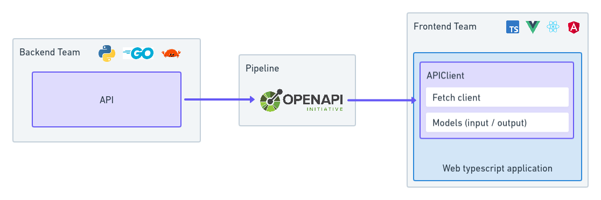

# Integrate OpenAPI to TS app

Demonstrate a strategy to limit api integration friction in a typescript application.

> Application could be split into two parts: frontend and backend. Extra attention will be required as we need to integrate the api communication.
> We will explore a solution to avoid mistake and facilitate integration.

<p align="center">
  
</p>

## Summary

- [Integrate OpenAPI to TS app](#integrate-openapi-to-ts-app)
  - [Summary](#summary)
  - [Tools](#tools)
  - [Exploration](#exploration)
    - [1. Generate the OpenAPI from the API code source](#1-generate-the-openapi-from-the-api-code-source)
      - [Python](#python)
    - [2. Generate & use the typescript client](#2-generate--use-the-typescript-client)
    - [3. Models](#3-models)
  - [Automating](#automating)
    - [1. Generate NPM typescript client](#1-generate-npm-typescript-client)
      - [Github Actions](#github-actions)
      - [Gitlab CI](#gitlab-ci)
    - [2. Integration](#2-integration)
  - [Playground](#playground)
  - [Contributing](#contributing)
  - [License](#license)

## Tools

This repository uses:

- [OpenAPI TypeScript codegen](https://github.com/ferdikoomen/openapi-typescript-codegen#openapi-typescript-codegen): generates typescript clients based on the openapi specification
- [Github Action](https://docs.github.com/en/actions): Continuous Integration Job, to generate and publish the generated typescript client to NPM
- [FastAPI](https://fastapi.tiangolo.com/): Python framework to build api and to generate openapi
- [Vitesse lite](https://github.com/antfu/vitesse-lite): Vue boilerplate using typescript
- [Docker compose](https://docs.docker.com/compose/): To quickly run the application

## Exploration

Quick overview of how to generate step by step a typescript client from a FastAPI

### 1. Generate the OpenAPI from the API code source

#### Python

Build a [FastAPI](https://fastapi.tiangolo.com/) which natively generates openapi.

**[api/routers/recipes_comments.py](./api/routers/recipes_comments.py)**

```python
router = APIRouter(
    tags=["recipesComments"],
    responses={"403": ERROR_RESPONSES[403]},
)

@router.post(
    "/recipes/{recipe_id}/comments",
    name="recipes comments create",
    ...
)
def recipes_comments_create():
    ...
```

The following script generates the `openapi.json`,

**[api/openapi.py](./api/openapi.py)**

```python
import json

from fastapi import FastAPI
from fastapi.routing import APIRoute
from fastapi.openapi.utils import get_openapi

from main import app


def use_route_names_as_operation_ids(app: FastAPI) -> None:
    for route in app.routes:
        if isinstance(route, APIRoute):
            route.operation_id = route.name.replace(" ", "_")


use_route_names_as_operation_ids(app)

print("Creating openapi.json file...")
with open("openapi.json", "w") as openapi_file:
    openapi_schema = get_openapi(
        title="My App",
        version="0.0.1",
        description="This is a very random API",
        routes=app.routes,
    )
    json.dump(openapi_schema, openapi_file)
print("openapi.json file generated")
```

_Note: As FastAPI generates too complex `OperationId` the script overrides it. [More detail from the FastAPI doc](https://fastapi.tiangolo.com/advanced/path-operation-advanced-configuration/#exclude-from-openapi)._

```sh
[api] (venv) $ python openapi.py`
Creating openapi.json file...
openapi.json file generated
```

### 2. Generate & use the typescript client

```sh
> npx openapi-typescript-codegen --input openapi.json --output clients --useOptions --name FoodyClient
```

Integrate the generated client to the typescript app

```ts
import { FoodyClient } from 'clients'

const app = new FoodyClient({})
const client = app.RecipesCommentsService
client.recipesCommentsCreate({ ... })
```

### 3. Models

Responses and requests class are also converted to typescript interface and can be found in the [models/](./example/clients/models/) directory.

**[api/routers/schemas/recipes_comments.py](./api/routers/schemas/recipes_comments.py)**

```python
class RecipeComment(BaseModel):
    id: int
    message: str
```

**[examples/clients/models/RecipesComments.ts](./examples/clients/models/RecipesComments.ts)**

```ts
export type RecipeComment = {
    id: number;
    message: string;
};
```

## Automating

### 1. Generate NPM typescript client

Everytime a new tag is added to the api, the following github workflow will publish the package (Can be triggered instead when a release is created).

#### Github Actions

**[.github/workflows/publish.yml](./.github/workflow/publish.yml)**

```yml
name: Publish to NPM registry
on:
  push:
    tags:
      - '*'
  # release:
  #   types: [created]

defaults:
 run:
  working-directory: ./api

jobs:
  build:
    runs-on: ubuntu-latest
    steps:
      - name: Checkout
        uses: actions/checkout@v2
      - name: Setup Python
        uses: actions/setup-python@v4
        with:
          python-version: '3.10'
      - name: Install dependencies
        run: pip install -r requirements.txt
      - name: Generate openapi
        run: python openapi.py
      - name: Setup Node
        uses: actions/setup-node@v2
        with:
          node-version: '18.x'
          registry-url: 'https://registry.npmjs.org'
      - name: Convert OpenAPI to TS Client
        run: npx --yes openapi-typescript-codegen --input openapi.json --output clients --useOptions --name FoodyClient
      - name: Set npm version
        run:  npm version ${CI_COMMIT_TAG} --no-git-tag-version
      - name: Publish package on NPM
        run: npm publish
        env:
          NODE_AUTH_TOKEN: ${{ secrets.NPM_TOKEN }}
```

#### Gitlab CI

```yml
image: python:3.10.6-slim

cache:
  key:
    files:
      - api/requirements.txt
      - api/requirements-test.txt
  paths:
    - .cache/pip
    - venv/

generate_openapi:
  stage: deploy
  before_script:
    - python -V # Print out python version for debugging
    - pip install virtualenv
    - virtualenv venv
    - source venv/bin/activate
    - pip install -r api/requirements.txt -r api/requirements-test.txt
  script:
    - cd api/
    - python openapi.py
  artifacts:
    paths:
      - api/openapi.json
  only:
    - tags

publish_package:
  image: node:18.7.0-alpine
  stage: .post
  script:
    - cd api/
    - npx --yes openapi-typescript-codegen --input openapi.json --output clients --useOptions --name FoodyClient
    - npm version ${CI_COMMIT_TAG} --no-git-tag-version
    - NPM_PACKAGE_NAME=$(node -p "require('./package.json').name")
    - NPM_PACKAGE_VERSION=$(node -p "require('./package.json').version")
    - |
      {
        npm publish &&
        echo "Successfully published version ${NPM_PACKAGE_VERSION} of ${NPM_PACKAGE_NAME} to NPM registry"
      } || {
        echo "No new version of ${NPM_PACKAGE_NAME} published. This is most likely because version ${NPM_PACKAGE_VERSION} already exists in NPM registry."; exit 1
      }
  only:
    - tags
```

### 2. Integration

```sh
pnpm i -S integrate-openapi-to-ts-app
```

## Playground

```sh
$ docker compose up
[+] Running 2/2
 ⠿ Container integrate-openapi-to-ts-app-api-1 Recreated 0.1s
 ⠿ Container integrate-openapi-to-ts-app-app-1 Recreated 0.1s
...
```

Application will be available on [http://127.0.0.1:8080](http://127.0.0.1:8080)

## Contributing

Contributions are welcome, don't hesitate to [open discussion](https://github.com/manawasp/integrate-openapi-to-ts-app/discussions).

## License

The code source is licensed with MIT.
